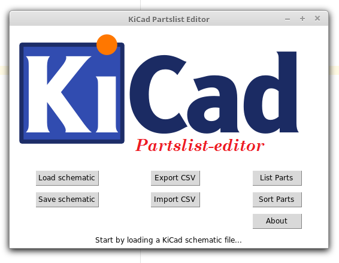

# KiCad Partslist Editor

KiCad Partslist Editor (PLE) allows you to export/import customizable fields from a hierarchical KiCad schematic file to and from a CSV. 

* Load the root sheet of your project
* export the CSV file
* edit this CSV in your favourite spreadsheet editor (e.g. LibreOffice Calc)
* backimport this CSV into KiCad PLE and save your changes then to your schematic file. 




## Installation

Running KiCad Partslist-editor using windows, requires either Python 3 and TKinter, or you can run the compiled version, which can be found in the folder \build\exe.win32-3.4\

On linux you have to install python3 and python3-tk with  
```sudo apt-get install python3 python3-tk```  
Then you can run the part list editor with 
python3 SCH_TO_CSV_OOP.py
or just use the minimal shell script "kicad-partlist-editor-linux.sh" on linux. 


## Usage

The 'Load Schematic' button, allows one to open the kicad .sch files, which subsequently parses the selected schematic file and all its hierarchical daughter modules.

Hitting the 'Export CSV' button will allow you to save a .CSV file containing the parsed contents of the schematic files.

'List Parts' shows the parts of the opened schematic in the GUI.

'Sort Parts' will sort the parts list in alphabetic order.

The 'Import CSV' button lets you select the csv file containing the the partslist as generated by KiCad PLE including the edits as made by the user using an external program.

The 'Save Schematic' button updates the schematic files with the updated information as loaded through the 'Import CSV' operation.


## Advanced Usage
To change the fields that the KiCad PLE imports, exports and edits, edit the FieldKeywords.conf file

The syntax of the **FieldKeywords.conf** file is:
First line is version string, this should not be changed
Lastline is end-of-file indicator

All lines starting with "<" define a field KiCad PLE will look for in .SCH files

The syntax of such a line is as follows:

``` <Fieldname|Field_alias1|Field_alias2|Field_alias3> ```

The Fieldname is the primary alias, so it can be considered Field_alias0 as well.

The amount of aliases which can be added is theoretically unlimited, but the minimum is 1 (i.e. the field name)

``` <MyFieldName> ``` isn't supported, one has to declare it with an alias:  
``` <MyFieldName|MyFieldName> ```
